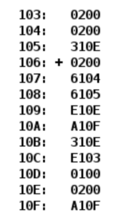

# ОПД: Лабораторная работа №2

## Вариант 171

По выданному преподавателем варианту определить функцию, вычисляемую программой, область представления и область допустимых значений исходных данных и результата, выполнить трассировку программы, предложить вариант с меньшим числом команд. При выполнении работы представлять результат и все операнды арифметических операций знаковыми числами, а логических операций набором из шестнадцати логических значений.

