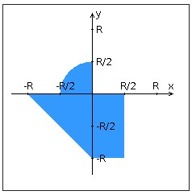

# Лабораторная работа 4, вариант 21321

[Отчет](task/lab4.docx)

## Задание 
Переписать приложение из предыдущей лабораторной работы с использованием следующих технологий:

* Уровень back-end должен быть основан на Java EE (необходимо использовать EJB).
* Уровень front-end должен быть построен на React + Redux (необходимо использовать ES6 и JSX) с использованием набора компонентов PrimeReact
* Взаимодействие между уровнями back-end и front-end должно быть организовано посредством REST API.

Приложение по-прежнему должно включать в себя 2 страницы - стартовую и основную страницу приложения. Обе страницы приложения должны быть адаптированы для отображения в 3 режимах:

* "Десктопный" - для устройств, ширина экрана которых равна или превышает 1177 пикселей.
* "Планшетный" - для устройств, ширина экрана которых равна или превышает 693, но меньше 1177 пикселей.
* "Мобильный"- для устройств, ширина экрана которых меньше 693 пикселей.

__Стартовая страница должна содержать следующие элементы:__
* "Шапку", содержащую ФИО студента, номер группы и номер варианта.
* Форму для ввода логина и пароля. Информация о зарегистрированных в системе пользователях должна храниться в отдельной таблице БД (пароль должен храниться в виде хэш-суммы). Доступ неавторизованных пользователей к основной странице приложения должен быть запрещён.

__Основная страница приложения должна содержать следующие элементы:__
* Набор полей ввода для задания координат точки и радиуса области в соответствии с вариантом задания: Listbox {'-2','-1.5','-1','-0.5','0','0.5','1','1.5','2'} для координаты по оси X, Text (-5 ... 3) для координаты по оси Y, и Listbox {'-2','-1.5','-1','-0.5','0','0.5','1','1.5','2'} для задания радиуса области. Если поле ввода допускает ввод заведомо некорректных данных (таких, например, как буквы в координатах точки или отрицательный радиус), то приложение должно осуществлять их валидацию.
* Динамически обновляемую картинку, изображающую область на координатной плоскости в соответствии с номером варианта и точки, координаты которых были заданы пользователем. Клик по картинке должен инициировать сценарий, осуществляющий определение координат новой точки и отправку их на сервер для проверки её попадания в область. Цвет точек должен зависить от факта попадания / непопадания в область. Смена радиуса также должна инициировать перерисовку картинки.
* Таблицу со списком результатов предыдущих проверок.
* Кнопку, по которой аутентифицированный пользователь может закрыть свою сессию и вернуться на стартовую страницу приложения.

Дополнительные требования к приложению:
* Все результаты проверки должны сохраняться в базе данных под управлением СУБД Oracle.
* Для доступа к БД необходимо использовать JPA.

 